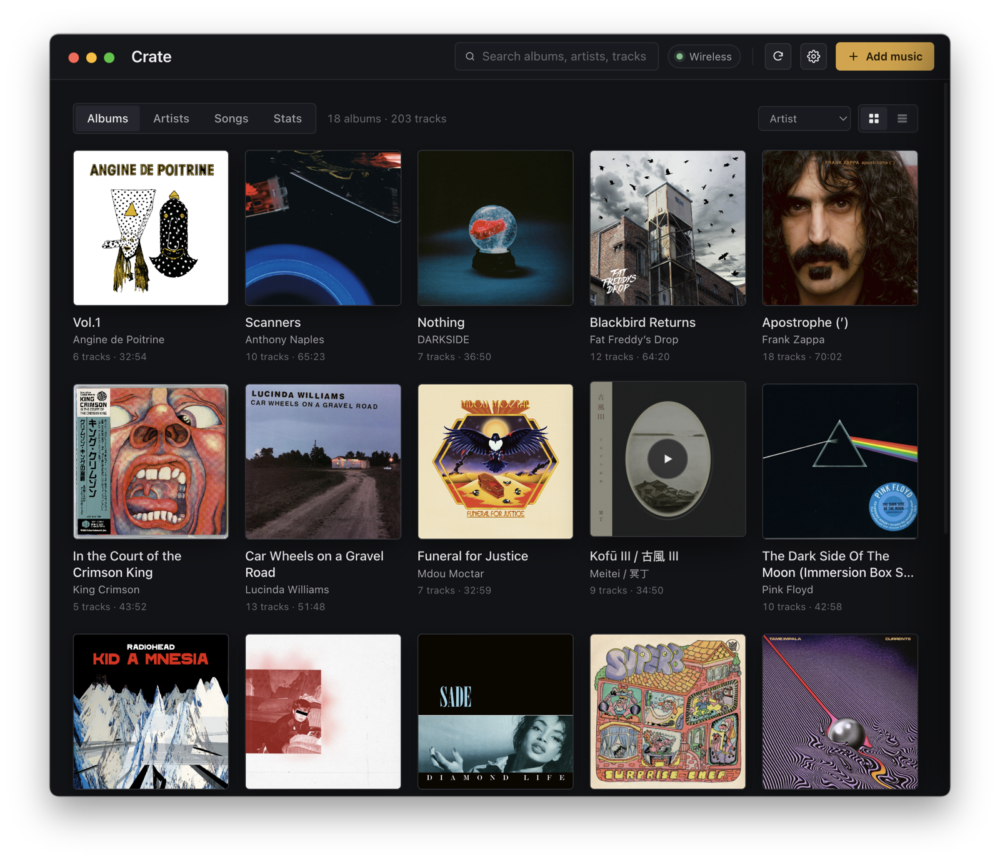

# Crate

[](https://buymeacoffee.com/ivancodes)

Your Android phone's music, on your Mac. Browse your collection with cover art, play it, and drag new tracks onto the phone over WiFi.

Crate is for people who use an Android phone, or an old one repurposed as a DAP (digital audio player), to carry their own local music (FLAC and friends) instead of streaming, and want a simple, seamless way to manage what's on it. It talks to the phone over wireless ADB, reads the library straight from Android, and keeps everything local.



Crate is free, and I plan to keep it that way. I build and maintain it on my own time, and I'll keep improving it. If it makes managing your music easier, you can support the work by [buying me a coffee](https://buymeacoffee.com/ivancodes).

## Install

1. Download the latest `Crate.dmg` from [Releases](../../releases).
2. Open it and drag **Crate** into Applications.
3. Launch it. A short setup wizard connects your phone (about a minute, the first time only).

It's signed and notarized by Apple, so it opens without any warnings. Crate bundles `adb`, so there is nothing else to install.

**Requirements:** a Mac with Apple Silicon (M1 or newer) and an Android phone. Intel Macs aren't covered by the prebuilt release yet, but you can build from source for one.

## What it does

- Browse your whole library as albums, artists, or one flat song list, with cover art.
- Play any track right on your Mac.
- Drag in files or whole folders to send them to the phone (it keeps the audio and cover art, skips the junk).
- Delete tracks or albums, with an undo.
- Save music back to your Mac.
- Recover messy metadata: artist, album, title, and track numbers get rebuilt from the folder and filenames when a rip has no tags, missing artists are looked up online, and durations are read from the file.
- Set or fetch album covers, see collection stats, and auto-sync a watched Mac folder.

## How connecting works

Crate uses ADB, Google's own tool, bundled inside the app.

- The first time, plug the phone in with a USB cable. The wizard helps you turn on USB debugging (with steps for Pixel, Samsung, Xiaomi, and OnePlus) and then flips the connection to WiFi.
- After that it reconnects over WiFi on its own whenever both devices are on the same network. Unplug the cable and forget about it.
- On macOS 15 and later you grant Crate one Local Network permission. The wizard detects if it's blocked and shows you how to fix it.

It works with any Android phone, since it uses standard Android APIs. Setup menus differ a little across brands, which the wizard handles. Xiaomi/MIUI is the fussy one: it wants a Mi account and an extra "USB debugging (Security settings)" toggle before ADB works.

## Privacy

Crate talks to your phone and nothing else, except anonymous album lookups to MusicBrainz, Cover Art Archive, and Wikipedia for artwork and descriptions.

## Build from source

```bash
npm install
npm run dev      # hot-reloading dev app (connect over USB)
npm run pack     # unsigned .app in dist/ for local testing
```

Wireless only works from a packaged build, not `npm run dev`, because macOS ties the Local Network permission to the real app bundle.

Cutting a signed, notarized DMG needs a Developer ID certificate in your keychain and these for notarization:

```bash
export APPLE_ID="you@example.com"
export APPLE_APP_SPECIFIC_PASSWORD="xxxx-xxxx-xxxx-xxxx"
export APPLE_TEAM_ID="XXXXXXXXXX"
npm run dist
```

The bundled `adb` is fetched at build time and is not committed to the repo.

## License

MIT, see [LICENSE](LICENSE).

Not affiliated with Google, Android, or Poweramp.
